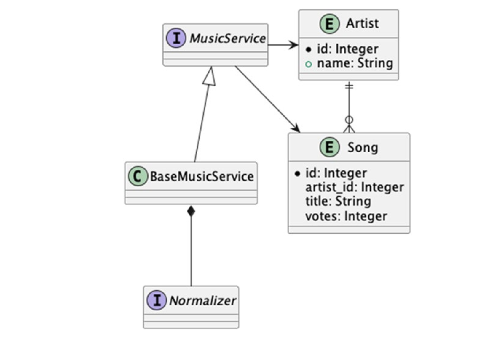

# Project 
Imagine you’re the fan of a band called “Threadbare Loaf.”4 If you were trying tointroduce a friend to Threadbare Loaf, they’d probably wonder what song (or songs) they should listen to, to get a sense of what Threadbare Loaf is about as an artist; you might suggest their first hit, “Someone Stole The  Flour,” or perhaps the single from their second release, “What Happened to Our First Release?”

These two songs might be considered the “hooks” for the artist. Most artists have a songor set  of songs that exemplify the band’s direction and focus; for the Rolling Stones, it might
be “Satisfaction” or “Jumpin’ Jack Flash”; for Pink Floyd it might be “Money” or “Comfortably
Numb”; for The Beatles, it might be “Hey Jude” or “Let It Be,” and so forth and so on.
It’s not that the artists’ other songs aren’t great, but that these are songs which a given
person might think were perfect to entice someone else to enjoy the band as well.

What we’re going to do is create an API for an application to allow users to suggest
“hooks” for artists, and for other users to see what users suggested most. It’s a simple
application, and we’re not going to construct a full user experience; we’re mostly going
to focus on the core API for the application to illustrate Spring concepts.
the application will be called the “band gateway,”
suggesting that the songs managed by the API are the “gateway songs” to appreciate the
artists in question.

We’re initially going to have two entities to consider as part of our data model: the Artist and the Song.

An Artist is uniquely referred to by name.5 We should expect to support only one
Artist with a given name, as long as we’re working only with music.
A Song is scoped to an Artist and does not have a unique name – it’s perfectly
legitimate to have a song called “Come Together” recorded by both The Beatles and
Aerosmith, for example, and users might consider these songs the ideal introductions
to both bands.6 We’re also aware that artists might have other types of media that serve
as “hooks” for the band, such as videos or other artistic works; for the purposes of
simplicity, we’re assuming that we are only managing audio recordings and not, say,
videos or paintings that might be associated with a given Artist.

Our application, in its initial form, needs to support a few basic read operations and two write operations.

The operations related to reading data are as follows:
* Retrieve songs for an artist, ordered by popularity (the most popular
song is the better “hook”).
* Retrieve song names for an artist (for use in autocompletion
operations).
* Retrieve a list of artist names (for use in autocompletion operations).
Then, we also need to allow people to contribute to our database:
* Record that a song exists.
* Vote for a song as a hook for a given Artist.
# Data Model
We’re going to need at least five classes to begin to construct our API: our model consists
of two classes (the Artist and Song), and we’re going to create an interface (called
Normalizer) that represents a method by which we can transform (or “normalize”)
names for our API, and lastly, an interface for our API (the MusicService) and a base
class that contains an in-memory representation of our model (BaseMusicService).

# API Design
## Services
MusicService has five primary operations:
* Retrieve songs for an artist, ordered by popularity (the most popular
song is the better “hook”).
* Retrieve song names for an artist (for use in autocompletion
operations, which we’re anticipating a more full-featured application
would use).
* Retrieve a list of artist names (for use in autocompletion operations).
* Record that a song exists.
* Vote for a song as a hook for a given Artist.
# Run
./mvnw install  -D maven.test.skip=true ; ./mvnw spring-boot:run -pl band-gateway-api

http://localhost:8080/artist/1
